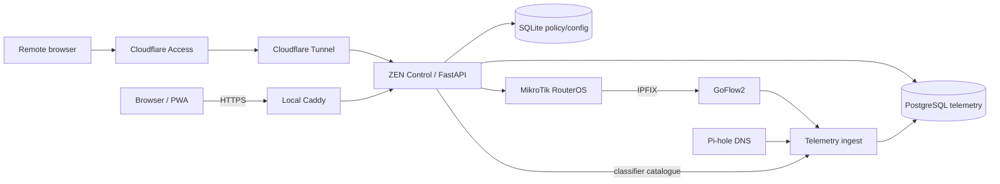

# ZEN Control

Self-hosted household network policy, parental controls and observability for MikroTik RouterOS.

ZEN Control keeps RouterOS as the enforcement authority while adding a parent-friendly control plane for managed-device policy, schedules, service controls, temporary access, rewards, quotas, telemetry, explainability and operational evidence.

> Current release: **v0.55.4** — External Delivery Adapters & Delivery Simulation: durable SMTP email and HMAC-signed webhook fan-out reuse the notification attention pipeline, with environment-only secrets and optional local Mailpit/webhook simulators under the `test-tools` Compose profile. External delivery remains notification-only and creates no RouterOS authority.

[](https://github.com/inspirepfs/zen-control/actions/workflows/quality.yml)

## Why ZEN exists

Consumer parental-control products often hide policy decisions behind opaque cloud services. ZEN takes a different approach: the enforcement point is your own MikroTik router, the application is self-hosted, authority boundaries are explicit, and missing evidence is reported as missing instead of being turned into reassuring guesses.

The project is designed around four rules:

- **RouterOS remains the network enforcement authority.** ZEN validates and orchestrates bounded policy changes rather than pretending the web UI is the firewall.
- **Observation and authority are separate.** Telemetry can fail without silently changing enforcement, and desired policy is never presented as proof that RouterOS historically executed it.
- **Dangerous changes fail closed.** Critical write paths require fresh validation, explicit ownership and post-write proof.
- **Evidence stays honest.** `UNKNOWN`, `UNAVAILABLE`, reporting-only and desired-policy states are kept distinct from enforced/healthy states.

## What it can do

ZEN currently provides:

- `NORMAL`, `SLOW` and `BLOCKED` household/device modes.
- Managed devices, profiles, policy groups, templates and assignments.
- Recurring schedules and date exceptions with explicit DST handling.
- Service-level blocking backed by validated RouterOS TLS/SNI contracts.
- Custom service definitions with separate reporting and enforcement approval.
- Aggregate policy groups that expand only to concrete services.
- Daily total/service/group quotas.
- Reward-time banks and bounded temporary parent-granted access.
- Policy simulation before writes.
- Effective-policy explainability and Device 360 views.
- Historical desired-policy checkpoints correlated with retained network evidence.
- IPFIX and Pi-hole-backed activity/classification reporting.
- Operational diagnostics, incidents, audit evidence and release-readiness checks.
- Notification Centre with durable inbox/history, acknowledgement lifecycle, quiet hours, severity thresholds, source/device filtering, per-event controls, cooldown-based noise suppression, correlation groups, escalation rules, lifecycle timelines, explanation provenance, digest/noise analytics, browser push, SMTP email and signed webhook delivery.
- TOTP parent authentication, recovery codes and shared-display locking.
- Progressive Web App support for tablet/mobile use, including standard encrypted browser/PWA push notifications that respect ZEN attention preferences.
- Cloudflare Access/Tunnel remote access and split-DNS local HTTPS.
- Controlled migration from MikroTik Kid Control with guarded cutover and rollback.
- Revisioned configuration state, optimistic concurrency, a transactional outbox and durable read-side background jobs.
- Prepared read models for Dashboard, Activity, Classification, Services, 7-day history and Device 360 activity evidence, with revision/age gating and bounded maintenance.
- Read-path fan-out closure for normal Dashboard, Activity and Managed Devices navigation: stale same-revision evidence is explicit, prepared refresh work is coalesced, and live PostgreSQL/RouterOS fallback is removed from ordinary navigation.
- Bounded parallel device observation/planning in the automatic reconciler, with deterministic results and per-device failure isolation.
- A process-wide re-entrant RouterOS mutation lane that serializes app-owned writes while leaving read-only observation parallel-capable.
- Topology-aware release deployment that rebuilds affected Compose services and proves the pre-release service topology plus embedded workers recovered before publication/tagging.

Automatic-reconciler observation concurrency is controlled by `ZEN_ROUTER_OBSERVE_WORKERS` (default `4`, bounded to `1`–`8`). It changes only read-side planning fan-out; it does not create additional RouterOS write authority and does not bypass the fresh serial proof performed before mutation.

See [CHANGELOG.md](CHANGELOG.md) for the release history.

## Architecture



The control application uses SQLite for policy/configuration and durable operational state. Retained activity is stored separately in PostgreSQL. RouterOS policy writes are serialized through explicit authority boundaries; telemetry and read-only analysis do not acquire enforcement authority.

More detail: [docs/ARCHITECTURE.md](docs/ARCHITECTURE.md).

## Safety model

ZEN deliberately does **not** own every RouterOS rule.

- Static critical firewall authority remains manually owned on RouterOS.
- Built-in service contracts are validated but are not silently created, reordered or repaired.
- App-owned custom-service rules use deterministic `MC|SVC|*` / `MC_*` namespaces and require explicit approval.
- Aggregate groups never receive aggregate RouterOS firewall authority.
- `/ip/kid-control/device` remains read-only during migration.
- Kid Control cutover changes only the exact validated legacy profile `disabled` flag after ZEN enforcement has been proven.
- Rollback restores legacy authority before unwinding migration-owned ZEN state.
- FastTrack must not bypass restricted devices.
- Telemetry loss does not disable RouterOS policy enforcement.

If authority validation fails, automatic enforcement is held closed for the affected write path rather than guessing a repair.

## Screenshots

The repository intentionally does not ship household screenshots containing live device names, addresses or activity. Sanitized screenshots are planned before public launch; the capture checklist is in [docs/screenshots/README.md](docs/screenshots/README.md).

Useful surfaces to show are:

- Dashboard / connected system health
- Managed devices and Device 360
- Effective policy explainability
- Policy Simulation
- Classification Intelligence
- Operational Diagnostics
- MikroTik Kid Control migration/authority state

## Requirements

A typical deployment needs:

- MikroTik RouterOS 7.x with API access from the ZEN host.
- Docker Engine with Docker Compose v2.
- A Linux Docker host on the LAN.
- A static/reserved address for the host.
- RouterOS firewall/address-list prerequisites described in [routeros/README.md](routeros/README.md).
- Optional: a Cloudflare zone/API token for local DNS-01 HTTPS and Cloudflare Access/Tunnel for remote access.

ZEN is currently an enthusiast/technical-user project rather than a one-click appliance. Review the RouterOS authority model before applying it to a production network.

## Quick start

Clone the repository and create a local environment file:

```bash
git clone https://github.com/inspirepfs/zen-control.git
cd zen-control
cp .env.example .env
```

Edit `.env` and replace every placeholder. At minimum configure:

- parent authentication secrets;
- RouterOS host/API credentials;
- PostgreSQL and Pi-hole passwords;
- the ZEN host LAN bind address and local CIDR;
- local HTTPS hostname and Cloudflare DNS API token if using the bundled Caddy service.

Generate strong application secrets, for example:

```bash
python3 -c 'import secrets; print(secrets.token_urlsafe(48))'
```

Then review [docs/INSTALL.md](docs/INSTALL.md) and [routeros/README.md](routeros/README.md) before starting the stack.

```bash
docker compose config
docker compose up -d --build
```

The control application listens on port `8080` internally/for direct LAN diagnostics. The bundled Caddy service provides the intended local HTTPS path when configured.

## Remote access

Remote access is optional and disabled by default. The supported design is:

```text
Internet → Cloudflare Access → Cloudflare Tunnel → cloudflared → ZEN :8080
```

Cloudflare Access is the outer identity gate; it does not replace ZEN parent authentication/TOTP. The connector is outbound-only and publishes no router port forward.

Keep the remotely-managed tunnel token outside the source tree. The pinned cloudflared container runs as UID/GID `65532:65532`; a file-backed token can be owned `root:65532` with mode `0640` so it is readable by the connector without becoming world-readable.

See [docs/INSTALL.md](docs/INSTALL.md) for commissioning notes.

## MikroTik Kid Control migration

ZEN can read an existing Kid Control configuration, translate it into a staged proposal and perform a guarded authority transfer.

The transfer requires fresh evidence that:

- the legacy fingerprint still matches the staged proposal;
- translation has no semantic warnings;
- each configured device has a unique MAC/IP match and static DHCP lease;
- existing ZEN policy does not conflict;
- automatic reconciliation is in `ENFORCE` mode;
- RouterOS enforcement authority is healthy;
- a fresh parent authenticator/recovery code is supplied.

After a successful transfer, the materialised ZEN policy is active while the legacy Kid Control profile is **disabled but retained** for rollback. Legacy device membership/schedules are never deleted by the migration flow.

## Evidence boundaries

Activity is retained **network evidence**, not browser history and not proof of who used a device. Generic HTTPS traffic is not guessed into a service. Historical policy checkpoints prove what desired policy ZEN observed, not continuous historical RouterOS execution.

Classification coverage and diagnostics preserve degraded states such as `NO EVIDENCE`, `UNAVAILABLE`, `INCONSISTENT`, `NO CONTRACT` and reporting-only rather than coercing them into zero or healthy values.

## Parent summary

Activity → Summaries provides a read-only daily digest over managed devices using retained network evidence. It compares equivalent time windows, surfaces traffic/DNS/service attribution, blocked/new DNS attention and current quota signals where available. It **does not assign an opaque risk score**, infer intent, or claim browser history or user identity.

## Parent summary delivery

Optional scheduled delivery consumes the same Parent Summary contract rather than running a second analytics path. SMTP credentials and the optional webhook bearer token remain **environment-only secrets**. Delivery uses durable outbox identities and idempotency metadata, while documenting the **unavoidable at-least-once crash boundary** after an external service accepts a message but before local success is committed. Delivery never changes RouterOS or policy state.

## Effective policy explainability

`/api/policy/explain/<ip>` and the corresponding UI compose the existing effective desired policy with fresh RouterOS evidence. The decision chain includes profile/default, device override, schedules/date exceptions, quota evaluation, temporary access, global mode, service provenance, bandwidth and live state. The explainer is read-only and **never creates, repairs or reorders RouterOS authority**.

## Device 360

`/api/devices/<ip>/360` exposes the `zen_device_360_v1` contract used by the Device 360 operational view. It combines the existing policy explanation with reward/quota/access state, retained activity and bounded incident/audit correlation. **Device 360 is read-only**; missing telemetry degrades only the activity portion and is not converted to zero activity.

## Health and operations

Important endpoints include:

- `/health/live` — process liveness
- `/health/ready` — policy DB, RouterOS/security and worker readiness
- `/api/operations/diagnostics` — sanitized operational diagnostic contract
- `/api/security/posture` — RouterOS enforcement/security posture
- `/api/services/health` — service-contract health
- `/api/performance` — bounded in-memory performance evidence
- `/api/notifications/intelligence` — correlation, escalation, digest-preview and notification lifecycle evidence
- `/api/release-readiness` — current release gate evidence
- `/api/policy/explain/<ip>` — effective-policy explanation
- `/api/devices/<ip>/360` — Device 360 contract
- `/api/activity/policy-history` — desired-policy/history correlation
- `/api/migration/kid-control` — Kid Control migration status

## Formal performance acceptance

v0.54.4 promotes the existing performance instrumentation into a formal release gate. `/api/performance` retains bounded in-memory request evidence and now distinguishes valid/invalid samples, records min/p50/p95/p99/max, enforces the RouterOS transport budget as **exactly one coherent connection per valid RouterOS request**, and keeps missing connection evidence PENDING rather than treating it as zero. Slow outliers remain in the percentile population.

The same snapshot exposes non-authoritative operational evidence for prepared-view hits/misses/live fallbacks, durable background-worker cycle timing, parallel-observation worker utilisation and serialized RouterOS mutation-lane wait/contention. These measurements are observational only: they do not create a second RouterOS writer and do not relax fresh authority/read/post-write validation.

The absolute acceptance floor remains five valid samples per latency class; the recommended deliberate run is 20 samples per class. Capture a live authenticated snapshot from `/api/performance`, then evaluate it with:

```bash
python3 scripts/perf_acceptance.py zen-performance.json --json-out zen-performance-acceptance.json
```

The JSON report is intentionally sanitized to acceptance/configuration/runtime aggregates rather than retaining individual slow-request paths. The CLI returns non-zero for FAIL, PENDING or an invalid/inconsistent contract unless `--allow-pending` is explicitly used.

## Development and testing

Use an isolated Python environment and install `requirements.txt`:

```bash
python3 -m venv .venv
. .venv/bin/activate
pip install -r requirements.txt
```

Run the local quality gates:

```bash
python3 -m py_compile app/*.py telemetry/ingest/*.py
python3 scripts/ux_validate.py
python3 scripts/public_release_audit.py
python3 -m unittest discover -s tests -v
docker compose --env-file .env.example config >/dev/null
```

The project also runs these source-level checks in GitHub Actions.

See [CONTRIBUTING.md](CONTRIBUTING.md) before proposing changes that touch RouterOS authority, authentication, migration or evidence semantics.

## Repository layout

```text
app/                 FastAPI application, policy engine, RouterOS adapter and UI
telemetry/           GoFlow2 mapping and PostgreSQL/ingest components
scripts/             validation, performance and release tooling
routeros/            public RouterOS inspection/verification helpers and docs
deploy/caddy/         local HTTPS reverse proxy image/configuration
docs/                architecture, install and public-release documentation
tests/               regression, hostile and source-contract test suites
```

## Security

Do not commit `.env`, tunnel tokens, private keys, databases, support bundles or household exports. The repository includes an executable public-source audit, but it is not a substitute for rotating a credential that has ever been exposed.

Please report security issues privately as described in [SECURITY.md](SECURITY.md).

## License

A final open-source license is intentionally **not selected in v0.54.4**. The repository may be reviewed privately while the choice between a strong network copyleft license (AGPL-3.0) and a permissive license (Apache-2.0) is made. **Choose and add the root `LICENSE` file before changing the GitHub repository to public.**

That is an explicit public-release gate, not an accidental omission. See [docs/PUBLIC_RELEASE.md](docs/PUBLIC_RELEASE.md).
