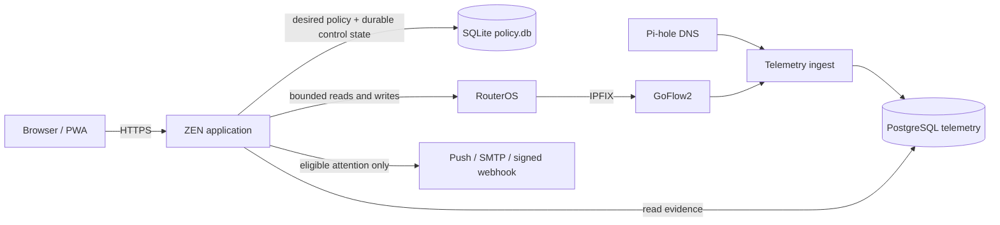

# ZEN Control system overview

ZEN Control is a self-hosted control plane for a household network. It lets a parent express and inspect policy, but it deliberately does not replace the router as the network enforcement point.

Read this first when evaluating or changing ZEN. The [architecture](ARCHITECTURE.md) is the canonical design explanation; [RouterOS integration](../routeros/README.md) is the canonical router contract; and the [operator route](README.md#operator-install-and-run-zen) contains installation and recovery instructions.

## What runs, where, and why

| Component | Actual role | Persists or receives | Authority boundary |
| --- | --- | --- | --- |
| Browser / PWA | Authenticated parent interface for policy, evidence, and operations | Session-local browser state | Cannot prove RouterOS execution or gain router administration. |
| `app/` FastAPI service | Jinja UI, authentication, desired-policy resolution, simulation, diagnostics, reconciliation coordination, and RouterOS adapter | SQLite control state; reads PostgreSQL evidence; bounded RouterOS API calls | May orchestrate only validated, application-owned RouterOS changes. |
| Docker Compose | Deploys the application, telemetry pipeline, Pi-hole, optional local HTTPS/remote-access and test profiles | Named volumes and container network relationships | Deployment topology does not confer policy or RouterOS authority. |
| MikroTik RouterOS | Live firewall, queues, schedules, address lists, and temporary-access fail-safe execution | Router configuration and live enforcement state | The sole network enforcement authority. Static critical rules remain operator-owned. |
| GoFlow2 + telemetry ingest + Pi-hole | Receives IPFIX and DNS evidence, classifies retained activity | PostgreSQL activity store and sanitized shared status/catalogue files | Observation only; telemetry has no RouterOS write path. |
| SQLite `policy.db` | Desired policy/configuration, revisions, audit, incidents, migration state, outbox, jobs, and prepared-view metadata | Durable Docker data volume | PolicyStore deliberately has no RouterOS client; stored intent is not enforcement proof. |
| PostgreSQL | Retained flow/DNS-derived activity and reporting history | Telemetry Docker volume | Evidence store, not browser history, identity proof, or policy authority. |
| Background and delivery workers | Prepare read models; consume durable jobs; send eligible push, SMTP, or signed webhook attention | SQLite job/outbox state and delivery records | Read-side and downstream only; they do not receive a RouterOS adapter. |

The Compose topology makes those relationships concrete: `mikrotik-control` owns the SQLite volume and reads the `telemetry-state` volume; RouterOS sends IPFIX to `goflow2`; `traffic-ingest` combines that flow stream with Pi-hole evidence and writes PostgreSQL; the application reads retained evidence without making telemetry a prerequisite for enforcement. See [docker-compose.yml](../docker-compose.yml), [application entry point](../app/main.py), [policy store](../app/policy_store.py), and [telemetry ingest](../telemetry/ingest/).

## Deployment, configuration, and retained state

The normal `docker compose up -d --build` topology starts the control application, flow-pipe initializer, GoFlow2, PostgreSQL, Pi-hole, telemetry ingest, and local Caddy HTTPS proxy. `cloudflared` is stopped unless the `remote-access` profile is explicitly enabled; Mailpit and the webhook sink are local-only notification simulators in the `test-tools` profile. They are not production dependencies.

| Logical volume or mount | Current owner/use | Recovery implication |
| --- | --- | --- |
| `mikrotik-control-data` | ZEN's `/data`: `policy.db`, durable control state, and application-owned generated material such as the VAPID private key | Back up policy data before an application rebuild. Restore it with the matching long-lived encryption material, especially `OTP_ENCRYPTION_KEY`; a database alone cannot decrypt enrolled TOTP state. |
| `telemetry-postgres-data` | PostgreSQL retained activity/reporting data | Preserve and restore separately from policy state; missing retained activity must remain missing/degraded evidence, never become zero activity. |
| `pihole-etc`, `flow-pipe`, `telemetry-state` | Pi-hole state, GoFlow2-to-ingest FIFO, and ingest/classifier status handoff | These support observation. Their failure can degrade classification/activity views without granting or removing RouterOS policy authority. |
| `caddy_data`, `caddy_config` | Caddy certificate and runtime configuration state | Preserve when retaining local HTTPS identity; DNS API credentials remain outside these volumes in environment configuration. |

Use [Installation and commissioning](INSTALL.md) for the supported host and Compose sequence, and [the environment contract](ENVIRONMENT.md) for the `.env` catalogue, conditional settings, validation, recreation, and secret-rotation rules. Run `python3 scripts/env_validate.py` before rendering Compose. Treat `docker compose config` as sensitive on a configured host because interpolation can include secrets. After an environment change, recreate only the affected services; a running container does not reread `.env`.

The intended user path is LAN HTTPS through Caddy. Port `8080` is available for direct LAN diagnostics, not Internet publication. RouterOS API is trusted management traffic from the ZEN host, and IPFIX on UDP/2055 is optional observation traffic. PostgreSQL is host-loopback only; other internal dependencies should remain on the Docker/LAN boundary. Cloudflare Tunnel, when commissioned, is outbound-only and must be protected by Cloudflare Access.

## What the product surfaces mean

The UI and APIs join several independent evidence planes; a useful result in one plane does not fill a gap in another.

| Area | What it joins | Important limit |
| --- | --- | --- |
| Service intelligence and classification | IPFIX, Pi-hole DNS, the service catalogue, and retained activity to show attribution/coverage | Generic HTTPS is not guessed into a service; unavailable evidence remains explicit. |
| Policy evaluation, simulation, and explanation | Profiles/defaults, device overrides, schedules/date exceptions, quotas, rewards, temporary access, global mode, service provenance, bandwidth, and fresh router state | The simulator and `/api/policy/explain/<ip>` are read-only explanations of effective desired policy plus observation; neither repairs RouterOS. |
| Analytics and Parent Summary | Prepared activity/reporting views, seven-day history, classification quality, quota signals, and comparable daily windows | This is retained network evidence, not browser history, intent, or identity; prepared views may be stale/preparing/missing. |
| Device 360 | Policy explanation, reward/quota/access state, retained activity, and bounded audit/incident correlation | `/api/devices/<ip>/360` is read-only. Telemetry loss degrades its activity portion rather than reporting zero. |
| Attention and temporary access | Policy-controlled temporary access plus eligible in-app, browser-push, SMTP, and signed-webhook delivery | Delivery is downstream of durable incident/policy state; a failed channel never clears the underlying condition or changes RouterOS. |
| Diagnostics and PWA | Independent health/security/transport evidence, sanitized support export, and device-local install/push observations | Browser install/push is browser/device controlled. Diagnostics intentionally exclude origins, credentials, household activity, and push endpoint/key material. |

## Degraded operation and recovery routes

Start with the failed evidence plane rather than restarting or weakening unrelated components. The [operator guide](OPERATOR_GUIDE.md) is the canonical day-2 procedure.

| Symptom | Interpret it as | First recovery route |
| --- | --- | --- |
| Security posture is held or RouterOS writes do not converge | A static authority, FastTrack, API reachability, list/queue/script, ordering, or duplicate-rule contract cannot be proven | Stop unrelated changes; run `routeros/inspect.rsc` and `routeros/setup/99-verify.rsc`, repair only the proven static defect, then recheck Settings → Security. Do not bypass the write gate. |
| Activity, classification, or reports are absent/stale | Observation-path degradation, not proof that policy stopped | Check RouterOS IPFIX export → GoFlow2 → telemetry ingest → PostgreSQL and Pi-hole separately. Retain `UNAVAILABLE`/`UNKNOWN` rather than inventing zero data. |
| Push, SMTP, or webhook delivery retries/fails | A delivery-channel issue after source state was recorded | Review Notifications → Delivery and environment presence/conditional settings without printing secrets. Use the `test-tools` profile only for isolated simulation, then restore production-safe settings. |
| HTTPS works but install/push behavior differs by device | Browser/PWA evidence differs, or a local transport prerequisite is incomplete | Use Settings → Parent access → Install / reinstall diagnostics and compare copied, device-local evidence. `PROMPT NOT OFFERED` is not a server failure; ZEN cannot force a browser prompt. |
| Some views work while a dependency is degraded | A deliberate partial-failure boundary | Use `/health/live`, `/health/runtime`, `/health/ready`, Settings → Security, Operational Diagnostics, and Release Readiness to identify the specific plane. Do not treat a green process or dashboard as complete authority, telemetry, or rendered-HTML proof. |

For a sanitized support artifact, use the Diagnostics page or the documented in-container support CLI in the [operator guide](OPERATOR_GUIDE.md#logs-and-safe-diagnostics). The bundle is deliberately read-only and excludes logs, credentials, raw identities, DNS queries, and traffic rows.

## Validation and release boundaries

Use [Contributing](../CONTRIBUTING.md) for developer setup and local checks, and [Release and maintenance checklist](PUBLIC_RELEASE.md) for the release order: configuration validation, source/UX/unit checks, rendered-container smoke, RouterOS verification, supply-chain evidence, and retained release evidence. Health endpoints alone do not qualify a release: `/login` and an authenticated rendered route must also work after a rebuild or dependency change.

The fresh-install acceptance is intentionally destructive only within its documented boundary: `scripts/fresh_install_acceptance.py` requires an explicitly confirmed throw-away Compose project and uses `docker compose down -v` there. It is restricted to isolated CI or a disposable development host, must never target a live ZEN project, and intentionally has no RouterOS authority. A correct run proves new local runtime/database state while RouterOS readiness remains `BLOCKED` or `UNAVAILABLE`; it must not manufacture a router-ready result.

## Policy and RouterOS authority

ZEN computes desired policy from managed devices, profiles, schedules, exceptions, quotas, rewards, temporary access, service contracts, and global mode. It can simulate and explain that result before requesting reconciliation.

For an enforcement change, the application serializes mutation ownership, freshly proves the RouterOS security/authority contract, freshly rereads the relevant router state, calculates the minimal change, writes it, verifies the result, and records durable evidence. The automatic reconciler may parallelize observation and planning, but it owns the single mutation lane before any write. This is implemented at the RouterOS adapter and reconciler boundaries, not merely documented intent. See [app/router.py](../app/router.py) and [app/reconciler.py](../app/reconciler.py).

ZEN may:

- manage validated, application-owned dynamic RouterOS resources in documented `MC_*` / `MC-*` namespaces;
- apply policy modes and approved custom-service contracts through the guarded write path;
- perform the narrow, verified Kid Control authority transfer described in the [RouterOS guide](../routeros/README.md#kid-control);
- report desired policy, fresh router observations, and retained telemetry as distinct evidence classes.

ZEN deliberately may not:

- offer arbitrary RouterOS command execution or claim the router is only a passive target;
- create, reorder, or silently repair static critical firewall authority, built-in service contracts, or unsafe FastTrack posture;
- give aggregate policy groups aggregate firewall authority; groups expand to concrete services;
- treat telemetry, prepared views, notifications, cached observation, or historical desired-policy checkpoints as permission to write or proof of continuous enforcement;
- infer browser history, user intent, or user identity from DNS/IPFIX activity;
- make loss of telemetry disable RouterOS enforcement.

When a required authority contract cannot be proven, ZEN holds the affected write path rather than guessing a repair. Follow the [RouterOS authority-hold procedure](../routeros/README.md#when-zen-reports-an-authority-hold).

## Persistence and evidence

Policy/configuration and operational control state are separate from retained network evidence. SQLite records the desired state and durable work needed to operate ZEN; PostgreSQL records activity evidence. A transactional outbox and revision journal connect local configuration changes to bounded background preparation, while leases, idempotency keys, and scope locks prevent background jobs from becoming a second authority path.

Prepared views are revision- and freshness-bound read optimizations. They may be displayed as fresh, stale, missing, or preparing, but never enter mutation authority. The definitive details and failure semantics are in [architecture](ARCHITECTURE.md#current-persistence-and-background-work-model) and [the shared glossary](reference/glossary.md).

## Why RALPH-Lite is in this repository

RALPH-Lite supervises changes to ZEN where the code, tests, documentation, and release evidence actually live. Keeping its controller and its human-approved plans beside the product lets it establish recovery checkpoints against the exact worktree, enforce protected paths and test-change policy, run repository qualification, and preserve an auditable record of each approved change.

RALPH is engineering-process infrastructure, not a runtime component of the deployed ZEN stack and not a source of RouterOS authority. The controller—not the model—owns approval state, loop accounting, qualification, recovery, and publication. Start at the [RALPH documentation tree](ralph/README.md); continue to the [RALPH-Lite operator guide](RALPH-LITE.md), [RALPH glossary](reference/glossary.md#ralph-lite-terms), and [controller policy](../.ralph/policy.md).
