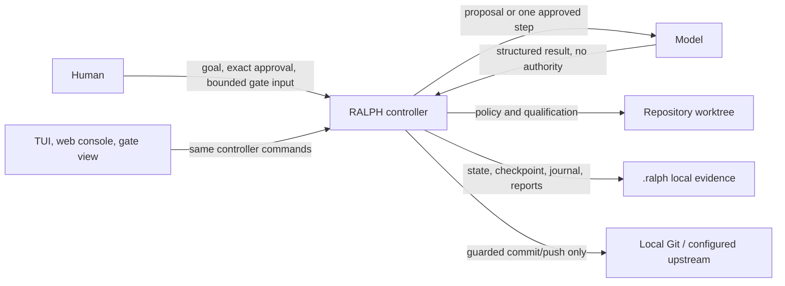

# RALPH-Lite architecture

## Control plane

`scripts/ralph.py` is the deterministic supervisor. It owns state transitions, policy enforcement, qualification, recovery checkpoints, repair accounting, reports, and guarded Git finalization. The model is called read-only for a proposal and workspace-write for one approved implementation step. The TUI, web console, and gate renderer use the same controller state; they are not alternate state machines.

The controller, not a model result or an operator view, is the authority that turns an implementation result into an accepted step or a publication action.

## Approval and enforcement boundaries

The plan is persisted with its SHA-256 hash in `AWAITING_APPROVAL`. Approval requires the supplied hash, persisted state hash, and rendered plan to agree. Before `APPROVED`, the controller saves a recovery checkpoint and baseline file origins. Steering is recorded separately and does not alter the plan hash.

For a step, the controller snapshots protected authority, invokes the model, restores prohibited authority edits, applies test policy, records changes, then qualifies them. Final qualification records gates, output, timing, completion time, and a fingerprint of the exact plan delta. Finalization rechecks the delta and Git scope; push checks the configured upstream.

| Evidence | Purpose | Boundary |
| --- | --- | --- |
| `.ralph/state.json` | Status, plan hash, current step, repair, qualification, publication fields | Controller-owned; do not hand-edit to advance work |
| `.ralph/plan.md` | Rendered proposal/approved plan | Must match persisted plan at approval/recovery checks |
| `.ralph/recovery/`, `refs/ralph/recovery/` | Approval-time baseline and recovery anchor | Human recovery aid, not automatic rollback authority |
| Journal, live log, events, reports | Durable loop/gate/human-decision audit | Model output is evidence, not a transition itself |

## External limits

RALPH's autonomous loop has no live RouterOS, deployment, secret-store, or production-system integration and must not read credentials or `.env` files. Git remote publication is controlled repository evidence only: no force-push, invented remote, or claim that publication proves deployment or runtime health.
