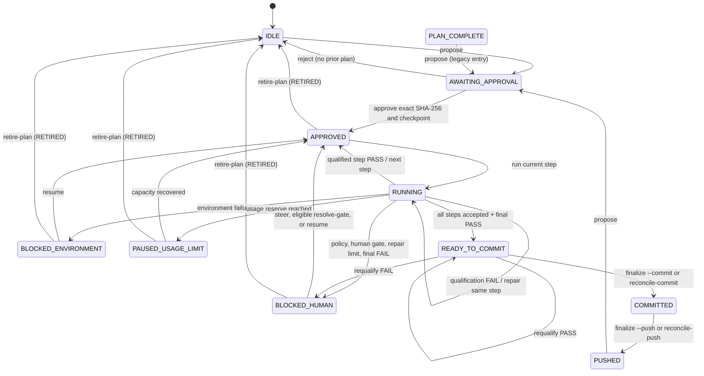

# RALPH-Lite lifecycle

This reference uses the controller's actual persisted `status` names. **Repair** and **final qualification** are phases/actions, not status nodes. `RETIRED` is an audited event returning to `IDLE`, not a persisted terminal status. `PLAN_COMPLETE` is only a legacy proposal-entry status, not current normal completion.



## State reference

| State | Entry and persisted evidence | Available / prohibited actions | Recovery, exit, successor |
| --- | --- | --- | --- |
| `IDLE` | Neutral initial or retirement/rejection reset; no active plan authority. Retirement history may retain plan/hash/reason. | Propose. No step execution, approval without a plan, or publication. | Valid proposal persists plan/hash → `AWAITING_APPROVAL`. |
| `AWAITING_APPROVAL` | Validated proposal, SHA-256 hash, current step, and prior-state snapshot persisted. | Human approve exact hash or reject. No implementation, steering, resume, or approval of edited plan. | Matching hash and rendered plan creates checkpoint → `APPROVED`; rejection restores prior eligible state or `IDLE`. |
| `APPROVED` | Exact approval, checkpoint id/ref, plan baseline, current step, reset repair context persisted; also pause point between steps. | Run, or retire. No plan edit, policy bypass, or use of old qualification for new work. | Run → `RUNNING`; retirement records `RETIRED` → `IDLE`; usage guard can → `PAUSED_USAGE_LIMIT`. |
| `RUNNING` | Loop count and current step persisted before turn. Evidence includes result, changed paths/class, gates/durations, and failure fingerprint. Repair uses `active_failure` in this status. | Controller runs current step, policies, qualification, and same-step repair. No different step, self-acceptance, repair-limit bypass, or publication. | PASS records step and → `APPROVED`; FAIL remains for repair; policy/human/final failure → `BLOCKED_HUMAN`; environment failure → `BLOCKED_ENVIRONMENT`; all steps plus final PASS → `READY_TO_COMMIT`. |
| `PAUSED_USAGE_LIMIT` | Usage snapshot, pause details, and reason persisted before another model turn. | Wait/poll or retire. No spending through reserve, success claim, or manual quota recovery claim. | Controller-confirmed capacity → `APPROVED`; retirement → `IDLE`. |
| `BLOCKED_HUMAN` | Block reason/gate and journal evidence; may retain policy evidence, active failure, or qualification output. | Review, bounded steer, resume, narrowly eligible resolve-gate, recover validation-only block, or retire. No generic confirmation of policy/repair failure, plan-hash change, or self-acceptance. | Steer/resume → `APPROVED` same step; eligible resolution records `HUMAN_CONFIRMED`, advances → `APPROVED`; recovery either advances on PASS or makes repair eligible; retirement → `IDLE`. |
| `BLOCKED_ENVIRONMENT` | Environment reason and journal entry persisted; plan/current step retained. | Repair environment then resume, or retire. No treating environment failure as PASS or skipping step. | Resume → `APPROVED` same step; retirement → `IDLE`. |
| `READY_TO_COMMIT` | All step results accepted; final qualification PASS, gates/output/durations/time, delta fingerprint, change summary, report persisted. | Review/report, requalify, guarded commit/reconcile, retire. No model publication, unrelated commit paths, push before commit, or reuse after delta change. | Requalify PASS remains; FAIL → `BLOCKED_HUMAN`; verified commit → `COMMITTED`; retirement → `IDLE`. |
| `COMMITTED` | Commit SHA/message or reconciliation note/time and refreshed report persisted. | Review, guarded push, reconcile-push. No force push, unrecorded commit, or unverified remote claim. | Push or verified upstream reconciliation → `PUSHED`. |
| `PUSHED` | Commit SHA, configured upstream, and push time persisted; reconciliation marker when applicable. | Review/report or propose new plan. No deployment, runtime-health, or RouterOS-enforcement claim. | New proposal → `AWAITING_APPROVAL`; otherwise completed published state. |

## Phase rules

Repair stays in `RUNNING`, is bound to the same failure fingerprint and current step, and blocks after three repair attempts. Audited human steering can reset the failure epoch but cannot accept the implementation.

Final qualification runs after the last step and writes evidence before transition: PASS → `READY_TO_COMMIT`; FAIL → `BLOCKED_HUMAN`. There is no `FINAL_QUALIFICATION` status. `resolve-gate` can record `HUMAN_CONFIRMED` only for operator/runtime evidence explicitly delegated by the approved step, never policy violations, active implementation failures, repair exhaustion, or ordinary judgement.

## Resource admission boundary

Execution has a plan-scoped resource admission boundary. Before the new proposal model turn, RALPH reads the supported Codex rate-limit surface and the live `.ralph/efficiency-policy.json`. Remaining allowance above the configured reserve (5% by default) admits the work; once the proposal is generated, that admission is bound to the resulting plan hash. The admission persists across process restarts so an interrupted, already-admitted plan is not stranded merely because its remaining allowance later falls below the reserve.

```text
APPROVED / PROPOSED WORK
    |
    +-- remaining > configured reserve --> ADMITTED(plan_hash) --> execute/validate/repair/review --> completion
    |                                                          |
    |                                                          +-- remaining later <= reserve --> continue same plan
    |
    +-- remaining <= configured reserve and no matching admission --> BLOCKED_INSUFFICIENT_START_RESERVE
```

Changing the reserve while a plan is running affects future admission decisions only. It does not revoke the current plan's existing admission. The live-policy file also carries an explicit five-limit profile for each of `STRICT`, `NORMAL`, and `RELAXED`, plus emergency runaway ceilings. The previous multiplier-based policy is migrated on read. Settings are re-read at model-turn and post-step decision boundaries, so an atomic web-console change can take effect during an active run without rewriting controller state.

Admission is not transferrable authority. A new proposal receives a new plan identity and no usage admission. Backend denial remains authoritative at all times.

Efficiency policy is orthogonal to admission. `STRICT`, `NORMAL`, and `RELAXED` enforce their own configured thresholds. `OFF` disables ordinary efficiency threshold enforcement and the web UI makes those inactive mode limits non-editable, but the emergency runaway guard and new-work reserve remain active.

## Live operator controls during execution

The web console deliberately keeps three live-control stores separate from controller authority:

- `.ralph/efficiency-policy.json` — atomically applied resource policy; reread between model turns/decision boundaries;
- `.ralph/model-policy.json` — optional project-local model override; changes affect the next Codex process, never the in-flight one;
- `.ralph/usage-stats-reset.json` — local token-report cutoff only; it does not alter provider quota or the append-only usage ledger.

A model selection, efficiency-policy update, or local token-stat reset is allowed while the controller job is active without replacing `web-job.json` or mutating the plan lifecycle state. The usage monitor refreshes immediately after model/reset-account/stat actions so the operator sees the resulting state without waiting for the periodic monitor interval.

Banked reset credits are provider/account capability, not plan authority. The web UI renders **Redeem** only when the live supported rate-limit surface reports available credits. The action always requires an operator confirmation dialog; the CLI independently requires `--confirm REDEEM` and the consume call is idempotency-keyed. No controller transition auto-redeems a credit.

The red **Reset token stats** action is intentionally different: it moves only the local reporting baseline. Existing ledger records remain intact and no provider reset/credit operation is invoked.

